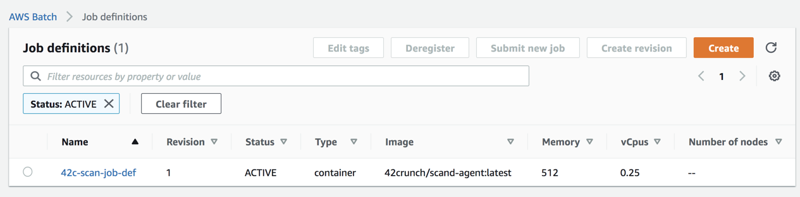
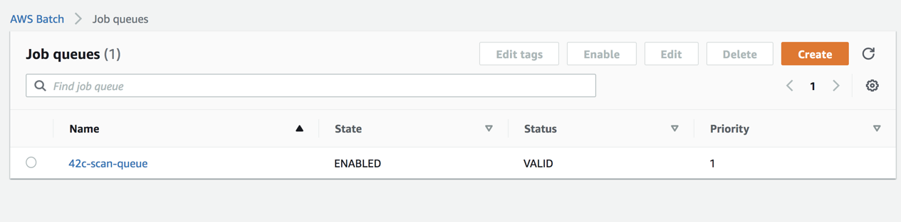

# On-Premises Conformance Scan Deployment

42Crunch Conformance Scan can be run on-premises in the new version of the 42Crunch API Security platform. 

The simplest way to run the on-premises scan engine is to use Docker:

```shell
docker run -e SCAN_TOKEN=<replace with your token value> -e PLATFORM_SERVICE=services.us.42crunch.cloud:8001 42crunch/scand-agent:latest
```

However, many customers have asked us to run the scan on demand in a batch environment. We have developed two ways to achieve that:

a. Leveraging [AWS Batch](https://docs.aws.amazon.com/batch/latest/userguide/Batch_GetStarted.html) 

b. Leveraging [Kubernetes jobs](https://kubernetes.io/docs/concepts/workloads/controllers/job/).

This document focuses on AWS Batch deployment.

## AWS Batch using Cloud Formation Templates

This sample has two main files:

1. `cluster-vpc-batch.yaml`: this creates a infrastructure to execute the batch job
2. `scan-job.yaml`: this creates the job definition as well as the job queue.

> Those two files are meant to illustrate how to deployment can be done. They need to be adapted to your environment, especially the VPC setup, which creates network definitions and security groups.

You need to first deploy the infrastructure:

```shell
aws cloudformation deploy --template-file cluster-vpc-batch.yaml --stack-name job-stack
```

Next, you need to define the JobQueue and compute environment, which in this case is Fargate - Note that the stack-name created above (**job-stack**) needs to be passed as the NetworkStackName  parameter (as several infrastructure/security resources are referenced in this template).

```shell
aws cloudformation deploy --template-file scan-job.yaml --stack-name scan-job --parameter-overrides NetworkStackName=job-stack  --capabilities CAPABILITY_NAMED_IAM
```

When the stack deployment completes, you should see a new JobDefinition and JobQueue on the AWS Batch console:





### Additional Parameters

The scan-job template admits the following additional parameters:

| Parameter Name         | Description           | Default                     |
| ---------------------- | --------------------- | --------------------------- |
| Image                  | Docker image repo/tag | 42crunch/scand-agent:latest |
| JobDefinitionName      | Job Definition name   | 42c-scan-job-def            |
| JobQueueName           | Job Queue name        | 42c-scan-queue              |
| ComputeEnvironmentName | Compute Env Name      | 42c-scan-compute-env        |

### Launching a job

Once the job definition has been installed, you can launch a job using a json file, with this command: `aws batch submit-job --cli-input-json file://job.json` 

The JSON file looks like this.

```json
{
    "jobName": "scan-test-job",
    "jobQueue": "42c-scan-queue",
    "jobDefinition": "42c-scan-job-def",
    "containerOverrides": {
        "environment": [
            {
                "name": "SCAN_TOKEN",
                "value": "scan-token-goes-here"
            }
        ]
    }
}

```

You can obtain the on-premises scan token following these instructions: [Conformance Scan Docs](https://docs.42crunch.com/latest/content/tasks/scan_api_conformance.htm#scrollNav-4)

If you deploy the job definition multiple times, you need to indicate the revision number, like this : 

```json
{
    "jobName": "scan-test-job",
    "jobQueue": "42c-scan-queue",
    "jobDefinition": "42c-scan-job-def:3",
```

