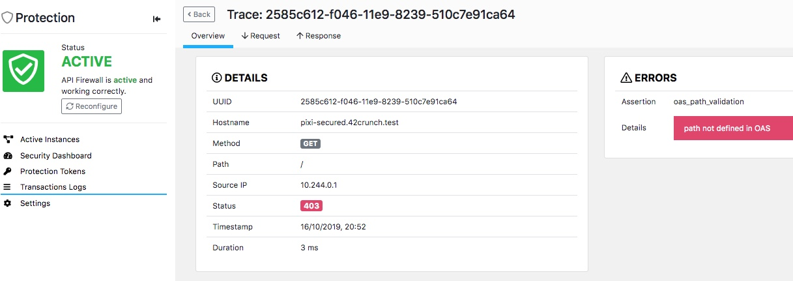
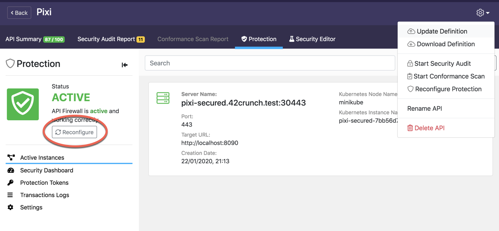

# 42Crunch API Firewall on Amazon ECS with Fargate (CTF)

[TOC]

## Introduction

This document describes how to deploy and test [42Crunch](https://42crunch.com/) API Firewall in AWS ECS with Fargate using a sample AWS CloudFormation template. For more information on [42Crunch Platform](https://platform.42crunch.com) and [42Crunch API Firewall](https://docs.42crunch.com/latest/content/concepts/api_protection.htm#Firewall), take a look at the [platform documentation](https://docs.42crunch.com/).

> The example setup in this document uses the Pixi API, a deliberately **vulnerable** API created as part of the [OWASP DevSlop](https://devslop.co/Home/Pixi) project to demonstrate common API issues.
>

## Platform Overview

The 42Crunch platform provides tools to quickly protect APIs from typical threats, such as mass assignment, data leakage, exception leakage, or injections as described in the [OWASP Top10 for API Security](https://apisecurity.io/encyclopedia/content/owasp/owasp-api-security-top-10.htm). The platform was built to empower developers to become key actors of API security, enabling them to address security concerns as early as possible in the API lifecycle.

Typically, the platform would be used as follows:

* Developers describe precisely API contracts using the OpenAPI specification format (aka Swagger). This can be done via annotations in the API implementation code or using specialized tools such as SwaggerHub or Stoplight.
* The OpenAPI definition is imported into the 42Crunch platform and audited: the audit service analyses the definition and gives a security score from 0 to 100. The score is calculated based on how the API is secured (authentication, authorisation and transport of credentials) and how well the data is defined (parameters, headers, schemas, etc.). This only can be done manually via our SaaS console, via the developers favorite IDE or via CI/CD pipelines. The entire functionality is available via a REST API, so that bulk import and audit can be performed via scripting as well.
* Developers improve the score by following the remediation recommendations given in the audit reports until they reach a satisfactory score (usually above 75) and have fixed all critical/high severity issues.
* The resulting OpenAPI file now describes precisely the inputs and outputs of our API and as such can be used as a configuration [whitelist](https://42crunch.com/adopting-a-positive-security-model/) for the 42Crunch API threats protection engine (API Firewall).

## Goals

This document guides you through:

1. Installing pre-requisites
2. Configuring the APIFirewall task values
3. Testing the API Firewall

## Prerequisites
In this guide, we deploy the 42Crunch API firewall in sidecar proxy mode (co-located in the same pod as the API) and use AWS ECS on top of Fargate as container orchestrator.

Before you start, ensure you comply with the following pre-requisites:

### 42Crunch resources project

You need to clone the 42Crunch resources project located on Github (https://github.com/42Crunch/resources) to get a local copy of the artifacts used in this guide.

### 42Crunch platform account

You must be a registered user on the [42Crunch Platform](https://platform.42crunch.com) to follow this guide. If you do not have an account, you can self-register at https://platform.42crunch.com/register.

### AWS CLI 

Make sure you have installed AWS CLI V2 (see instructions here: https://docs.aws.amazon.com/cli/latest/userguide/install-cliv2.html)

### API Firewall Image

In these instructions, we assume you have pushed the 42Crunch firewall image to your own ECS registry. The firewall image is available on DockerHub (https://hub.docker.com/r/42crunch/apifirewall/tags?page=1&ordering=last_updated)

### SaaS platform connection

When the API firewall starts, it connects to the platform at **[protection.42crunch.com](protection.42crunch.com/)** (community site) or **[protection.us.42crunch.cloud](protection.us.42crunch.cloud)** (production setup) on port **8001**. Make sure your network firewall configuration authorizes this connection.

> The connection is established from the  API firewall to the platform. It is a two-way, HTTP/2 gRPC connection. Logs and configuration are uploaded/downloaded through this connection.

### Tools

We recommend you install [Postman](https://www.getpostman.com/downloads/) to test drive the API. A Postman collection is provided to you in this repository.

# Configuring the API on the 42Crunch Platform

Import the Pixi API and generate the protection configuration

1. Log in to 42Crunch Platform

2. Go to **API Collections** in the main menu and click on **New Collection**, name it  PixiTest.

3. Click on **Add Collection**.

   

4. Click on **Import API** to upload the Pixi API definition from the file `OASFiles/Pixi-v2.0.json`. Once the file is imported, it is automatically audited.

   The API should score 94/100 in API Contract Security Audit: the API contract description in this file has been optimized, in particular for data definition quality (such as inbound headers, query params, access tokens, and responses JSON schema). This implies we can use it as-is to configure our firewall.

5. In the main menu on the left, click **Protect** to launch the protection wizard

6. Select the `PixiTest` API collection and the Pixi API, then enter a name for the protection token. This unique token is used later in this guide to configure the API Firewall.
    

7. Copy the protection token value to the clipboard. **Do not close this dialog** until you have safely saved the value (in the next step).
   

# Deployment Setup

For simplicity, the pixi app, the pixi db and the Firewall have been grouped into the same Fargate task and the firewall runs in HTTP mode, on port **8080** ( those settings can be changed within the sample CloudFormation templates, if you want).

## Protection Token Setup

The protection token is used by the API Firewall to retrieve its configuration from the platform. Think of it as a unique ID for the API protection configuration.

Save the protection token in a configuration file. This file is read by the deployment scripts to create a secret in AWS SecretsManager.

1. Edit  `etc/secret-protection-token` with any text editor.

2. Replace the placeholder `<your_token_value>` with the protection token you copied, and save the file:

```shell
<your_token_value>
```

## Creating the Protection Token secret

1. Use the `create-aws-secrets.sh` script to push the protection-token to  AWS secrets manager. This script assumes you're logged into the AWS CLI and have enough permissions to create the resources.

   > This assumes you're are using the CLI to create the files. You can create those  secrets through different means than this script, for example the AWS Console.

2. Note the ARN value of the **42c-protection-token** secret. You will need it later to configure the API Firewall task.

   ```JSON
   {
       "ARN": "arn:aws:secretsmanager:eu-west-1:749000XXXXX:secret:42c-protection-token-vwGqc8",
       "Name": "42c-protection-token",
       "VersionId": "34510b7c-a396-4e00-a9cc-4816c5ee4c9c"
   }
   ```

> You can delete the configuration file once the secret has been successfully created.


# Deploying the Cluster VPC

The first CloudFormation template, located under `firewall-deployment/aws-ecs-fargate-artifacts` deploys a sample, non-production cluster VPC, which provides the infrastructure to expose the API.

You can deploy it using this command:

```shell
aws cloudformation deploy --template-file cluster-vpc.yaml --stack-name pixi-cluster
```

Once deployed, open the AWS console and notethe value of ExternalHostname. This hostname will be used to invoke the API.


# API Firewall Deployment 

You need to now edit the sample CloudFormation template provided according to your setup. 

1. The apifirewall image value needs to be changed to point to the firewall image stored in your ECS registry, for example:

   ```yaml
   Parameters:
   ...
     ApiFirewallImage:
       Type: String
       Default: '749000XXXXXX.dkr.ecr.eu-west-1.amazonaws.com/42cfirewall:v1.0.1-preview'
   ```

2. Set the **PROTECTION_TOKEN** value from the secret created earlier - Use the ARN obtained via the AWS CLI. 

```yaml
	Parameters:
  ...
  ApiFirewallProtectionToken:
    Type: String
    Default: 'arn:aws:secretsmanager:eu-west-1:749000XXXXX:secret:42c-protection-token-vwGqc8'
```

## Deploying the API Firewall and Pixi example

Use this command to deploy the secured Pixi:

```shell
aws cloudformation deploy --template-file pixi_service_no_tls.yaml --stack-name pixi-service --parameter-overrides ClusterStackName=pixi-cluster --capabilities CAPABILITY_NAMED_IAM
```

**Make sure to use the name of the stack you deployed previously (in this case pixi-cluster) as the ClusterStackName parameter.**

# Getting ready to test the API firewall

1. Test the secured endpoint setup by invoking the hostname you have noted earlier,  for example: http://pixi-publi-1l02bnyoe1vom-3709e1770cf8bce1.elb.eu-west-1.amazonaws.com:8080 - You should receive a message like this one, indicating the firewall has blocked the request.

```json
{"status":404,"title":"path mapping","detail":"Not Found","uuid":"c90f2864-a8a1-4175-a631-74e6ce50d796"}
```

You can also use curl to make the same request (using the -k option to avoid the self-signed certificates issue): `curl -k http://pixi-publi-1l02bnyoe1vom-3709e1770cf8bce1.elb.eu-west-1.amazonaws.com:8080

2. Import the  `postman-collection/Pixi_collection.json` file in Postman using **Import>Import from File**.

3. Create  an [environment variable](https://learning.getpostman.com/docs/postman/variables-and-environments/variables/) called **42c_url** inside an environment called **42Crunch-Secure** and set its value to the hostname you just tested I (for example http://pixi-publi-1l02bnyoe1vom-3709e1770cf8bce1.elb.eu-west-1.amazonaws.com:8080).
   The final configuration should look like this in Postman:


8. Go to the Pixi collection you just imported and invoke the operation **POST /api/register** with the following contents:

    ```json
    {
      "id": 50,
      "user": "42crunch@getme.in",
      "pass": "hellopixi",
      "name": "42Crunch",
      "is_admin": false,
      "account_balance": 1000
    }
    ```

    You should see a response similar to this. The x-access-token is a JWT that you must inject in an x-access-token header for all API calls (except login and register):

```json
	{
    "message": "x-access-token: ",
    "token": "eyJhbGciOiJIUzI1NiIsInR5cCI6IkpXVCJ9.xxxx"
	}
```

Now that we know everything works, we can start testing the API Firewall.

# Blocking attacks with API Firewall

42Crunch API Firewall validates API requests and responses according to the OpenAPI definition of the protected API. In this section, you send various malicious requests to the API firewall to test its behavior.

## Viewing Transaction Logs

Whenever a request/response is blocked, transaction logs are automatically published to the 42Crunch platform. You can access the transaction logs viewer from the API protection tab. For each entry, you can view details information about the request and response step, as well as each step latency.



## Understanding Pixi

Pixi requires to register or login users to obtain a token, token which is then used to invoke other operations. The Postman has been setup to extract the token from login or register responses and add them automatically to the **current environment**, like this:

```javascript
var jsonData = pm.response.json();
pm.globals.set("token", jsonData.token);
```

Other operations, such getUserInfo or updateUserInfo take the value of the **token** variable set above and use it as the value of the **x-access-token** header, like this:


Make sure you always call either login or register before calling any other operations, or the request will fail at the firewall level, since the x-access-token header will be empty! When this happens, this is what you will see in the transaction logs of the API firewall .


## Blocking Pixi API sample attacks

You can test the API firewall behavior with the following requests:

1. **Wrong verb**: the operation `Register` is defined to use `POST`, try calling it with `GET` or other verbs, and see how requests are blocked.

   

2. **Wrong path**: any request to a path _not_ defined in the OAS definition is blocked, try `/api/foo`, for example.

3. **Wrong `Content-Type`**: the OpenAPI definition states that the operation `/api/register` requires input in the form of `application/json`. If you use a different value or if you do not specify the `Content-Type`, the request is blocked. The most famous attack based on crafting Content-Type value is [*CVE-2017-5638*](https://www.synopsys.com/blogs/software-security/cve-2017-5638-apache-struts-vulnerability-explained/), an issue in Apache Struts which is at the root of Equifax's and many others breaches.

4. **Missing a parameter** that the input JSON structure requires: the schema for the operation `/api/register` specifies that the parameters `user`, `name`, `email`, and `password` are mandatory. If you leave out any of these parameters, the request is blocked.

5. **Wrong format for string values**: if you specify a value (such as email) in a format that does not match the schema, the request is blocked. For example, try to register a user with email `user@acme.com@presidence@elysee.fr` (you can read how this was exploited by hackers [here](https://apisecurity.io/issue-28-breaches-tchap-shopify-justdial/) ).

6. **Blocking out of boundaries data**: the 42Crunch API firewall also validates integer boundaries. If you try to invoke `api/register` using a negative balance (-100) for example), the request is blocked. This prevents Overflow type attacks. Similarly, requests with strings which do not match the minLength/maxLength constraints are blocked.

7. **Blocking exception leakage**: the 42Crunch APIfirewall prevents data leakage or exception leakage. If you invoke `/api/register` using a negative balance between -50 and -1 , the response will be blocked. The backend API does not properly handle negative values and returns an exception. That exception is blocked by the firewall since the schema from the OAS file does not match the actual response.

8. **Blocking data leakage**: the Pixi API exposes an admin operation which lists all users within the database. This operation leaks admin status and passwords (it is a straight export from the backend database). If you invoke `API 5: Get Users List`, the response is blocked. You get an HTTP 502 error since the response from the back-end is invalid.

   

9. The Pixi API has a **MongoDB injection** vulnerability that allows logging into the application without specifying a password. You can try this by using the raw parameters `user=user@acme.com&pass[$ne]=` in Postman for a login request. You will see that you can log in to the unprotected API, but the request is blocked by API Firewall on the protected API.

10. **Mass assignment**:  the `API6: Mass Assignment` operation can be used to update a user record. It has a common issue (described in this [blog](https://42crunch.com/stopping_harbor_registry_attack/) ) by which a hacker with a valid token can change their role or administrative status. The OAS file does not declare is_admin as a valid input and as such this request will be blocked. Same occurs with the password. If you remove those two properties, the request will be accepted and both email and name are updated for the logged in user.

    

11. Reflected **XSS attack**: If you introduce a XSS attack like the example below in any property, the request is blocked:

    ```script
    <script>alert('hi')</script>
    ```

## Blocking admin operations

You have been able previously to invoke the `API5: Get Users List` admin operation, due to the fact it's declared in the Pixi OAS file. Although we blocked the response and prevented critical data from leaking, ideally we do not want this operation to be available. As such, we are going to replace the current OAS file, then update the configuration live.

1. Go to https://platform.42crunch.com and locate the Pixi API

2. At the top-right, select the Settings icon and choose **Update Definition**

   

3. Browse to the `resources/OASFiles` folder and select the `Pixi-v2.0-noadmin.json` file

4. Once the file has been imported, select the **Protection** tab

5. Click the **Reconfigure** button and type *confirm* to confirm the instance update

6. When the instance's list refreshes, it means the re-configuration was successful.

7. Back to Postman, try to invoke the `API5:Get Users list` operation. This time, the request is blocked with a 404 code, since this operation is not defined in the OpenAPI file anymore.


# Conclusion

In this evaluation guide, we have seen how the 42Crunch API firewall can be easily configured from an OAS file, with no need to write specific rules or policies. The OAS file acts as a powerful whitelist, thanks to the audit service which helps you pinpoint and remediate security issues.
