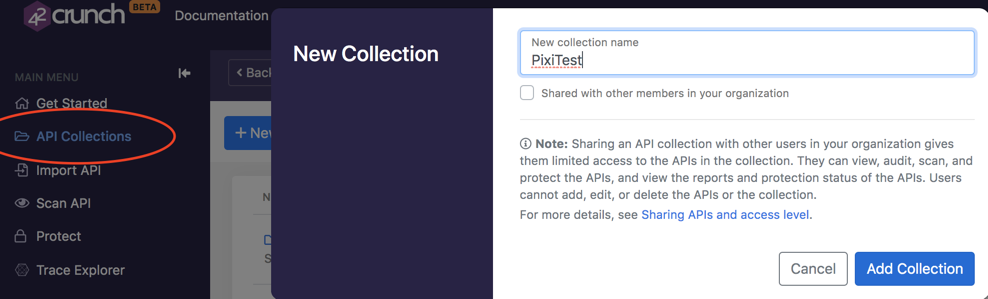

# Deploying 42Crunch API Firewall on Azure Kubernetes Service (AKS)

[TOC]
## Introduction

This document describes how to deploy and test [42Crunch](https://42crunch.com/) API Firewall in [Azure Kubernetes Service (AKS)](https://azure.microsoft.com/en-us/services/kubernetes-service/). For more information on [42Crunch Platform](https://platform.42crunch.com) and [42Crunch API Firewall](https://docs.42crunch.com/latest/content/concepts/api_protection.htm#Firewall), take a look at the [platform documentation](https://docs.42crunch.com/).

> The example setup in this document uses the Pixi API, a deliberately **vulnerable** API created as part of the [OWASP DevSlop](https://devslop.co/Home/Pixi) project to demonstrate common API issues. **We recommend that you install the Pixi API in a dedicated Kubernetes cluster, and delete the cluster once your tests are completed.** Do not leave the unprotected Pixi API running, it is vulnerable!

## Platform Overview

The 42Crunch platform provides tools to quickly protect APIs from typical threats, such as mass assignment, data leakage, exception leakage, or injections as described in the [OWASP Top10 for API Security](https://apisecurity.io/encyclopedia/content/owasp/owasp-api-security-top-10.htm). The platform was built to empower developers to become key actors of API security, enabling them to address security concerns as early as possible in the API lifecycle.

Typically, the platform would be used as follows:

* Developers describe precisely API contracts using the OpenAPI specification format (aka Swagger). This can be done via annotations in the API implementation code or using specialized tools such as SwaggerHub or Stoplight.
* The OpenAPI definition is imported into the 42Crunch platform and audited: the audit service analyses the definition and gives a security score from 0 to 100. The score is calculated based on how the API is secured (authentication, authorisation and transport of credentials) and how well the data is defined (parameters, headers, schemas, etc.). This only can be done manually via our SaaS console, via the developers favorite IDE or via CI/CD pipelines. The entire functionality is available via a REST API, so that bulk import and audit can be performed via scripting as well.
* Developers improve the score by following the remediation recommendations given in the audit reports until they reach a satisfactory score (usually above 75) and have fixed all critical/high severity issues.
* The resulting OpenAPI file now describes precisely the inputs and outputs of our API and as such can be used as a configuration [whitelist](https://42crunch.com/adopting-a-positive-security-model/) for the 42Crunch API threats protection engine (API Firewall).

## Goals

This document guides you through:

1. Getting an AKS cluster ready.
2. Importing an API contract into our SaaS platform and configuring the protection.
3. Deploying the unsecured API (Pixi API).
4. Deploying the 42Crunch API firewall protecting the unsecured API.
5. Testing the 42Crunch API Firewall in action.

## Prerequisites
In this guide, we deploy the 42Crunch API firewall in sidecar proxy mode (co-located in the same pod as the API) and use Kubernetes as orchestrator. Therefore, you need a basic understanding of [Kubernetes concepts](https://kubernetes.io/docs/concepts/) before running this guide.

Before you start, ensure you comply with the following pre-requisites:

### 42Crunch resources project

You need to clone the 42Crunch resources project located on Github (https://github.com/42Crunch/resources) to get a local copy of the artifacts used in this guide.

### 42Crunch platform account

You must be a registered user on the [42Crunch Platform](https://platform.42crunch.com) to follow this guide. If you do not have an account, you can self-register at https://platform.42crunch.com/register.

### AKS Kubernetes cluster

You must have an AKS Kubernetes cluster running, and proper credentials to deploy the artifacts to that cluster. If you don't already have one, you can create one in 3 easy steps:

1. Install [Azure CLI](https://docs.microsoft.com/en-us/cli/azure/install-azure-cli?view=azure-cli-latest).

2. Run the command `az login` to log into your Azure account.

3. Run the following commands to generate a minimal K8s cluster and connect to it. You must have sufficient privileges to run those commands! You can use the command `az account list-locations` to list all the locations for your Azure cluster, and change the value to the one that suits you best. Here, we are using *eastus*.

    ```shell
    az group create --name rg-42crunch --location eastus
    az aks create --resource-group rg-42crunch --name aks-42crunch --node-count 1 --node-vm-size Standard_D2s_v3 
    ```
    
    After a few minutes, you should have a Kubernetes environment ready for testing. 
    
4. Setup kubectl to point to your newly created cluster
    ```shell
    az aks get-credentials --resource-group rg-42crunch --name aks-42crunch
    ```
5. Check kubectl is properly configured by running `kubectl get nodes`

   ```shell
   NAME                                STATUS   ROLES   AGE   VERSION
   aks-nodepool1-xxxxxxxx-vmss000000   Ready    agent   27m   v1.15.11
   ```
6. Ensure that `kubectl` is properly configured to point to the cluster you defined previously. You can confirm this by running the command `kubectl config current-context`. The output should be similar to:

  ```text
  $ kubectl config current-context
  aks-42crunch
  ```
### Azure Marketplace API Firewall 

The default setup in this guide is using our API firewall image hosted on DockerHub. If you want to use an API firewall hosted on your own container registry on Azure cloud, follow these steps:

1. Go to https://azuremarketplace.microsoft.com/en-us/marketplace/apps/42crunch1580391915541.42crunch_api_firewall_container?tab=Overview and click Get it Now.
2. Choose an existing or setup a new container registry and subscribe - Make sure to use the automatic updates option so that new versions of API Firewall are automatically published to your registry.
3. Note the image name for example: `myregistry.azurecr.io/42crunch158039xxxx/apifirewall:latest`

### Running as-root

The API Firewall is started by the `root` user. The initial process as root reads the configuration and then forks child processes which will serve the requests. Those child processes run under the `guardian` user, which has no admin privileges nor can this user read the configuration or log files. 

Make sure that your Kubernetes environment allows for this container to start processes as root.

### SaaS platform connection

When the API firewall starts, it need to connect to our SaaS platform to a URL which varies depending on the platform you are using. Default is **[protection.42crunch.com](protection.42crunch.com/)** on port **8001**. Make sure your network firewall configuration authorizes this connection.

> This gRPC-based, secured connection is always established from the API firewall to the platform. Logs and configuration are uploaded/downloaded through this connection.

### Tools

We recommend you install [Postman](https://www.getpostman.com/downloads/) to drive test the API. A Postman collection is provided to you in this repository.

## Deployment artifacts

The deployment involves two types of artifacts: configuration artifacts and runtime artifacts. The scripts and conf files for Azure deployment are located under the `kubernetes-artifacts` folder.

### Configuration artifacts

The following configuration artifacts are created when you execute the deployment scripts:
- A TLS secret that contains the key-cert pair to protect the listening interface of the API firewall. The key-cert pair is signed with an ephemeral CA and has been created for the hostname `pixi-secured.42crunch.test`. You can find the keys and certs under `etc/tls`.
- A generic secret that contains the protection token identifying the API firewall configuration to run.
- A config map that is populated from the file `etc/deployment.properties`. The config map contains properties that affect how the firewall gets configured at deployment time.

### Runtime artifacts

The scripts create two deployments:
- `PixiSecured`, which exposes the protected Pixi API (all API calls go through the API Firewall deployed in a sidecar mode)
- `Pixiapp`, which exposes the original, unprotected Pixi API so that you can directly invoke the vulnerable API

Both deployments are fronted by load balancers and point to a [MongoDB](https://www.mongodb.com/what-is-mongodb) deployed behind a service named `pixidb`.


## Configuration Setup

Import the Pixi API and generate the protection configuration

1. Log in to 42Crunch Platform at <https://platform.42crunch.com> (or your assigned platform)

2. Go to **API Collections** in the main menu and click on **New Collection**, name it  PixiTest.

3. Click on **Add Collection**.

   

4. Click on **Import API** to upload the Pixi API definition from the file `OASFiles/Pixi-v2.0.json`. Once the file is imported, it is automatically audited.

   The API should score around 89/100 in API Contract Security Audit: the API contract description in this file has been optimized, in particular for data definition quality (such as inbound headers, query params, access tokens, and responses JSON schema). This implies we can use it as-is to configure the API firewall.

5. In the main menu on the left, click **Protect** to launch the protection wizard

6. Select the `PixiTest` API collection, and the Pixi API, and enter a name for the protection token. This unique token is used later in this guide to configure the API Firewall.
    

7. Copy the protection token value to the clipboard. **Do not close this dialog** until you have safely saved the value (in the next step).
   

# Configuration Deployment

## Configuring the deployment scripts

The protection token is used by the API Firewall to retrieve its configuration from the platform. Think of it as a unique ID for the API protection configuration.

You must save the protection token in a configuration file. This file is read by the deployment scripts to create a Kubernetes secret.

1. Edit  `etc/secret-protection-token` with any text editor.

2. Replace the placeholder `<your_token_value>` with the protection token you copied, and save the file:

   ```shell
   PROTECTION_TOKEN=<your_token_value>
   ```

3. [Optional] If you have subscribed to the API Firewall container offering from the Azure marketplace

   1. Edit the `pixi-secured-deployment.yaml` file and look for this section:

   ```yaml
   spec:
     containers:
     - name: apifirewall
       image: '42crunch/apifirewall:latest'  
   ```

   2. Replace `42crunch/apifirewall:latest` by the value you noted at the beginning of this guide, for example `myregistry.azurecr.io/42crunch158039xxxx/apifirewall:latest` and save the file.

> You will need to establish an integration between your Azure AKS cluster and your Azure container registry following these instructions: https://docs.microsoft.com/en-us/azure/aks/cluster-container-registry-integration or add secrets to your deployment to that it can access the registry.

4. [Optional] The platform protection endpoint needs to be changed according to the 42Crunch platform you are using, should it be our customer platforms or a dedicated instance. If your platform is acme.42crunch.com, then the protection endpoint will be: protection.acme.42crunch.com. Port is always 8001. See the 42Crunch [documentation](https://docs.42crunch.com) for details.

```yaml
      - name: apifirewall
        image: '42crunch/apifirewall:latest'
        imagePullPolicy: Always
        args: ["-platform", "protection.42crunch.com:8001"]
        command: ["/bin/squire"]
```

## Deploying the API Firewall

>By default, the artifacts are deployed to a namespace called `42crunch`. If you want to change the namespace, edit the `etc/env` file and change the namespace value before you run the script.

1. Depending on your environment, run either the `pixi-create-demo.sh` or `pixi-create-demo.bat` script to deploy the sample configuration:

```shell
# Create secrets
kubectl create --namespace=$RUNTIME_NS secret tls firewall-certs --key ../etc/tls/private.key --cert ../etc/tls/cert-fullchain.pem
kubectl create --namespace=$RUNTIME_NS secret generic protection-token --from-env-file=../etc/secret-protection-token

# Config Map creation
kubectl create --namespace=$RUNTIME_NS configmap firewall-props --from-env-file=./deployment.properties

# Deployment (Required App/DB + storage)
kubectl apply --namespace=$RUNTIME_NS -f pixi-basic-deployment.yaml

# Deployment (Pixi + FW as sidecar pod)
kubectl apply --namespace=$RUNTIME_NS -f pixi-secured-deployment.yaml
```

> Should the scripts fail for any reason, you can start from a clean situation using the deletion scripts.

2. Run `kubectl get pods -w -n 42crunch`  and wait until all pods are successfully running. It takes usually a couple minutes the first time, since the docker images must be pulled from the DockerHub registry.

```shell
NAME                            READY   STATUS    RESTARTS   AGE
 pixi-8c94b66b5-hq8js            1/1     Running   0          5m
 pixi-secured-54d957c8bc-h867f   2/2     Running   0          5m
 pixidb-755f648d47-k5pm9         1/1     Running   0          5m
```

3. Back to the 42Crunch platform, check that you see the firewall in the list of active instances. This means the firewall has properly registered itself to the platform.

   

If one of the pixi secured containers is not running or you can't see the instance in the SaaS UI, it means the firewall did not start properly. In this case, check the logs using this command (substitute the pod name by yours). Most common reasons are bad token value and bad platformUrl value. 

`kubectl logs pixi-secured-54d957c8bc-h867f -c apifirewall`

#### Kubernetes dashboard

If you want to see/monitor the various artifacts which have been created (pods, services, deployments and secrets), you can launch the Kubernetes standard dashboard, like this:

```shell 
az aks browse --resource-group rg-42crunch --name aks-42crunch
```

Then, change the default namespace to 42crunch to browse all artifacts.

> If you get authorization issues in the dashboard, see those instructions: https://docs.microsoft.com/en-us/azure/aks/kubernetes-dashboard.

### Getting ready to test the firewall

We now have a running configuration with two endpoints: one that invokes the unsecured API and the other one that invokes the secured API.

1. Run `kubectl get svc -n 42crunch` to get the external IP of the `pixisecured` deployment (values shown here are placeholders):

   ```shell
   NAME               TYPE           CLUSTER-IP     EXTERNAL-IP     PORT(S)          
   pixi-open          LoadBal..   		10.0.94.87     <pixi-app-ip>   8090:30800/TCP   
   pixi-secured-svc   LoadBal..   		10.0.148.121   <pixi-secu-ip>  443:32547/TCP    
   pixidb             ClusterIP      10.0.247.78    <none>          27017/TCP        
   ```

2. Go to edit your `hosts` file, and add the `pixisecured` and `pixi-open` deployments to it. Replace the placeholders `<pixi-secu-ip>` and `<pixi-app-ip>` with the actual external IPs returned by the command above:

   ```shell
   <pixi-secu-ip> pixi-secured.42crunch.test
   <pixi-app-ip>  pixi-open.42crunch.test
   ```

3. Test the open endpoint setup by invoking http://pixi-open.42crunch.test:8090 - You should receive a message like this one, indicating you have connected to the API.

   ```json
   {
     "message": "Welcome to the Pixi API, use /api/login using x-www-form-coded post data, user : email, pass : password - Make sure when you authenticate on the API you have a header called x-access-token with your token"
   }
   ```

4. Test the secured endpoint setup by invoking https://pixi-secured.42crunch.test - You should receive a message like this one, indicating the firewall has blocked the request.

   > The API Firewall is configured with a self-signed certificate. You will have to accept an exception for the request to work properly.

   ```json
   {
       "status": 404,
       "title": "path mapping",
       "detail": "Not Found",
       "instance": "https://pixi-secured.42crunch.test/",
       "uuid": "c07ec70e-9a00-11ea-xxxx-1f92a4422262"
   }
   ```

   You can also use curl to make the same request, using the -k option to avoid the self-signed certificates issue: `curl -k https://pixi-secured.42crunch.test`

#### Postman Setup

1. Import the  `postman-collection/Pixi_collection.json` file in Postman using **Import>Import from File**.

2. Create  an [environment variable](https://learning.getpostman.com/docs/postman/variables-and-environments/variables/) called **42c_url** inside an environment called **42Crunch-Secure** and set its value to https://pixi-secured.42crunch.test to invoke the protected API. Create another environment called **42Crunch-Unsecure** with the same 42c_url variable, this time with a value set to http://pixi-open.42crunch.test:8090.
   The final configuration should look like this in Postman:

   

   


3. Select the **42Crunch-Unsecure** environment

4. Go to the Pixi collection you just imported and invoke the operation **POST /api/register** with the following contents:

    ```json
    {
      "id": 50,
      "user": "42crunch@getme.in",
      "pass": "hellopixi",
      "name": "42Crunch",
      "is_admin": false,
      "account_balance": 1000
    }
    ```

    You should see a response similar to this. The x-access-token is a JWT that you must inject in an x-access-token header for all API calls (except login and register):

```json
	{
    "message": "x-access-token: ",
    "token": "eyJhbGciOiJIUzI1NiIsInR5cCI6IkpXVCJ9.xxxx"
	}
```

Now that we know everything works, we can start testing the API Firewall with specific attacks.

# Blocking attacks with API Firewall

42Crunch API Firewall validates API requests and responses according to the OpenAPI definition of the protected API. In this section, you send various malicious requests to the API firewall to test its behavior.

## Viewing Transaction Logs

Whenever a request/response is blocked, transaction logs are automatically published to the 42Crunch platform. You can access the transaction logs viewer from the API protection tab. For each entry, you can view details information about the request and response step, as well as each step latency.


## Understanding Pixi

Pixi requires to register or login users to obtain a token, token which is then used to invoke other operations. The Postman has been setup to extract the token from login or register responses and add them automatically to the **current environment**, like this:

```javascript
var jsonData = pm.response.json();
pm.globals.set("token", jsonData.token);
```

Other operations, such getUserInfo or updateUserInfo take the value of the **token** variable set above and use it as the value of the **x-access-token** header, like this:


Make sure you always call either login or register before calling any other operations, or the request will fail at the firewall level, since the x-access-token header will be empty! When this happens, this is what you will see in the transaction logs of the API firewall .


## Blocking Pixi API attacks

You can test the API firewall behavior with the following requests:

1. **Wrong verb**: the operation `Register` is defined to use `POST`, try calling it with `GET` or other verbs, and see how requests are blocked.

   

2. **Wrong path**: any request to a path _not_ defined in the OAS definition is blocked, try `/api/foo`, for example.

3. **Wrong `Content-Type`**: the OpenAPI definition states that the operation `/api/register` requires input in the form of `application/json`. If you use a different value or if you do not specify the `Content-Type`, the request is blocked. The most famous attack based on crafting Content-Type value is [*CVE-2017-5638*](https://www.synopsys.com/blogs/software-security/cve-2017-5638-apache-struts-vulnerability-explained/), an issue in Apache Struts which is at the root of Equifax's and many others breaches.

4. **Missing a parameter** that the input JSON structure requires: the schema for the operation `/api/register` specifies that the parameters `user`, `name`, `email`, and `password` are mandatory. If you leave out any of these parameters, the request is blocked.

5. **Wrong format for string values**: if you specify a value (such as email) in a format that does not match the schema, the request is blocked. For example, try to register a user with email `user@acme.com@presidence@elysee.fr` (you can read how this was exploited by hackers [here](https://apisecurity.io/issue-28-breaches-tchap-shopify-justdial/) ).

6. **Blocking out of boundaries data**: the 42Crunch API firewall also validates integer boundaries. If you try to invoke `api/register` using a negative balance (-100) for example), the request is blocked. This prevents Overflow type attacks.  Similarly, requests with strings which do not match the minLength/maxLength constraints are blocked.

7. **Blocking exception leakage**: the 42Crunch APIfirewall prevents data leakage or exception leakage. If you invoke `/api/register` using a negative balance between -50 and -1 , the response will be blocked. The backend API does not properly handle negative values and returns an exception. That exception is blocked by the firewall since the schema from the OAS file does not match the actual response.

8. **Blocking data leakage**: the Pixi API exposes an admin operation which lists all users within the database. This operation leaks admin status and passwords (it is a straight export from the backend database). If you invoke `API 5: Get Users List`, the response is blocked. You get an HTTP 502 error since the response from the back-end is invalid.

   

9. The Pixi API has a **MongoDB injection** vulnerability that allows logging into the application without specifying a password. You can try this by using the raw parameters `user=user@acme.com&pass[$ne]=` in Postman for a login request. You will see that you can log in to the unprotected API, but the request is blocked by API Firewall on the protected API.

10. **Mass assignment**:  the `API6: Mass Assignment` operation can be used to update a user record. It has a common issue (described in this [blog](https://42crunch.com/stopping_harbor_registry_attack/) ) by which a hacker with a valid token can change their role or administrative status. The OAS file does not declare is_admin as a valid input and as such this request will be blocked. Same occurs with the password. If you remove those two properties, the request will be accepted and both email and name are updated for the logged in user.

   

11. Reflected **XSS attack**: If you introduce a XSS attack like the example below in any property, the request is blocked:

    ```script
    <script>alert('hi')</script>
    ```

## Blocking admin operations

You have been able previously to invoke the `API5: Get Users List` admin operation, due to the fact it's declared in the Pixi OAS file. Although we blocked the response and prevented critical data from leaking, ideally we do not want this operation to be available. As such, we are going to replace the current OAS file, then update the configuration live.

1. Go to https://platform.42crunch.com and locate the Pixi API

2. At the top-right, select the Settings icon and choose **Update Definition**

   

3. Browse to the `resources/OASFiles` folder and select the `Pixi-v2.0-noadmin.json` file

4. Once the file has been imported, select the **Protection** tab

5. Click the **Reconfigure** button and type *confirm* to confirm the instance update

6. When the instance's list refreshes, it means the re-configuration was successful.

7. Back to Postman, try to invoke the `API5:Get Users list` operation. This time, the request is blocked with a 404 code, since this operation is not defined in the OpenAPI file anymore.


# Conclusion

In this evaluation guide, we have seen how the 42Crunch API firewall can be easily configured from an OAS file, with no need to write specific rules or policies. The OAS file acts as a powerful whitelist, thanks to the audit service which helps you pinpoint and remediate security issues.

# Clean Up

To delete all the artifacts you created, you can just delete the  namespace with the command `kubectl delete namespace NAMESPACE`. If you used the default namespace from this guide, the command is:

 ```shell
    kubectl delete namespace 42crunch
 ```

You can also delete the whole Kubernetes cluster. If you used the names suggested in these examples, the command is:

```shell
    az aks delete --resource-group rg-42crunch --name aks-42crunch
```

