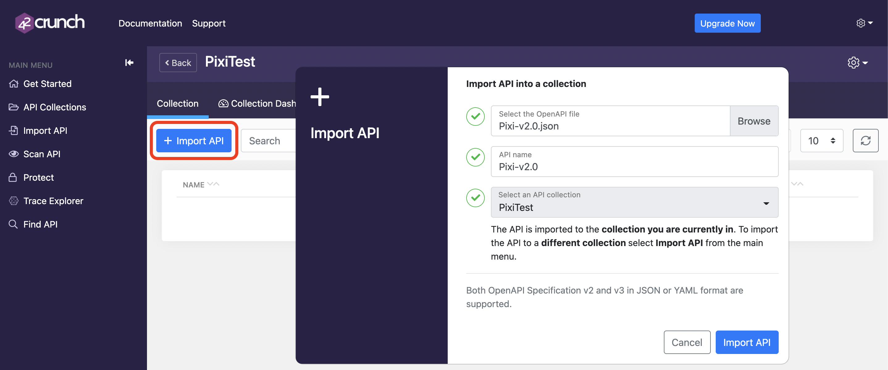

# Deploying 42Crunch API Firewall with Docker Compose

## Introduction

This document describes how to deploy and test [42Crunch](https://42crunch.com/) API Firewall on you local machine using [Docker Compose](https://docs.docker.com/compose/). To learn more about our technologies see our platform documentation for [42Crunch Platform](https://docs.42crunch.com/latest/content/concepts/about_platform.htm) and [42Crunch API Firewall](https://docs.42crunch.com/latest/content/concepts/api_protection.htm#Firewall).

## Goals

The example setup in this document uses the Pixi API, a deliberately **vulnerable** API created as part of the [OWASP DevSlop](https://devslop.co/Home/Pixi) project to demonstrate common API issues.


This document guides you through:

1. Importing an API contract into our SaaS platform and configuring the protection.
2. Deploying the unsecured API (Pixi API).
3. Deploying the 42Crunch API firewall protecting the unsecured API.
4. Verifying the 42Crunch API Firewall is successfully deployed.

## Prerequisites

Before you start, ensure you comply with the following pre-requisites:

### 42Crunch resources project

You need to clone the 42Crunch resources project located on Github (https://github.com/42Crunch/resources) to get a local copy of the artifacts used in this guide.

### 42Crunch platform account

You must be a registered user on the [42Crunch Platform](https://platform.42crunch.com) to follow this guide. If you do not have an account, you can self-register at https://platform.42crunch.com/register.

### SaaS platform connection

When the API firewall starts, it needs to connect to our SaaS platform at **[protection.42crunch.com](protection.42crunch.com/)** on port **8001**. Make sure your local computer and/or network firewall configuration authorizes this connection.

> This gRPC-based, secured connection is always established from the API firewall to the platform. Logs and configuration are uploaded/downloaded through this connection.

### Docker Compose

The guide uses Docker Compose to create and start containers for deploying the firewall and Pixi API. Make sure you have Docker Compose installed on your machine (https://docs.docker.com/compose/install/) and that you have internet access to pull the docker images from DockerHub. 

Note: Docker Desktop for Mac or Windows includes Docker Compose by default. You can verify the installation by running the command `docker-compose version`.

```
% docker-compose version
Docker Compose version v2.0.0
```

### API Testing Tools
We recommend you install [Postman](https://www.getpostman.com/downloads/) to test drive the API. A Postman collection is provided for you in this repository.

## Configuration Steps

### Import the OpenAPI contract for Pixi API

1. Log in to 42Crunch Platform at <https://platform.42crunch.com> (or your assigned platform)

2. Go to **API Collections** in the main menu and click on **New Collection**, name it PixiTest.

3. Click on **Add Collection**.

    

4. Click on **Import API** to upload the Pixi API definition from the file `OASFiles/Pixi-v2.0.json`. Once the file is imported, it is automatically audited.

    

   The API should score around 89/100 in API Contract Security Audit: the API contract description in this file has been optimized, in particular for data definition quality (such as inbound headers, query params, access tokens, and responses JSON schema). This implies we can use it as-is to configure our firewall.

### Create a Firewall Configuration to Protect Pixi API

1. In the main menu on the left, click **Protect** to launch the protection wizard

2. Select the `PixiTest` API collection, and the Pixi API, and enter a name for the protection token. This unique token is used later in this guide to configure the API Firewall.

    

3. Copy the protection token value to the clipboard. **Do not close this dialog** until you have safely saved the value (in the next step to configure the deployment).

    

## Deployment Steps

### Run Docker Compose Up

1. Open a terminal and navigate to the docker-compose-artifacts folder. Run the following command, replacing `<token>` with the protection token value copied to the clipboard in the previous step

    ```
    PROTECTION_TOKEN=<token> docker-compose -p 42crunch -f protect.yml up pixi-secured.42crunch.test
    ```

    The secured Pixi API is now accessible on your local machine through the 42Crunch API Firewall at: https://pixi-secured.42crunch.test:4241 

    The unsecured Pixi API is also exposed directly at: http://pixi-open.42crunch.test:8090. This allows you to compare and contrast the response from the API when it is protected by the API Firewall and when it is unprotected. 


### Verify the API Firewall deployment

1. [Edit your `hosts` file](https://support.rackspace.com/how-to/modify-your-hosts-file/) and add the `pixisecured` and `pixi-open` service endpoints to it. 

   ```shell
   127.0.0.1    pixi-secured.42crunch.test
   127.0.0.1    pixi-open.42crunch.test
   ```

2. Test the open endpoint setup by invoking http://pixi-open.42crunch.test:8090 - You should receive a message like this one, indicating you have connected to the API.

   ```json
   {
     "message": "Welcome to the Pixi API, use /api/login using x-www-form-coded post data, user : email, pass : password - Make sure when you authenticate on the API you have a header called x-access-token with your token"
   }
   ```

3. Test the secured endpoint setup by invoking https://pixi-secured.42crunch.test:4241 - You should receive a message like this one, indicating the firewall has blocked the request.

   > The API Firewall is configured with a self-signed certificate. You will have to accept an exception for the request to work properly. Or if using curl to make the same request, using the -k option to avoid the self-signed certificates issue: `curl -k https://pixi-secured.42crunch.test:4241`

    ```json
    {
      "status":403,
      "title":"request validation",
      "detail":"Forbidden",
      "instance":"https://pixi-secured.42crunch.test:4241",
      "uuid":"60ec6862-5899-11ea-8376-2354dd014e4d"
    }
    ```

4. Import the  `postman-collection/Pixi_collection.json` file in Postman using **Import>Import from File**.

5. Create  an [environment variable](https://learning.getpostman.com/docs/postman/variables-and-environments/variables/) called **42c_url** inside an environment called **42Crunch-Secure** and set its value to https://pixi-secured.42crunch.test:4241 to invoke the protected API. Create another environment called **42Crunch-Unsecure** with the same 42c_url variable, this time with a value set to http://pixi-open.42crunch.test:8090. 
  
6. Select the **42Crunch-Unsecure** environment

7. Go to the Pixi collection you just imported and invoke the operation **POST /api/register** with the following contents:

    ```json
    {
      "id": 50,
      "user": "42crunch@getme.in",
      "pass": "hellopixi",
      "name": "42Crunch",
      "is_admin": false,
      "account_balance": 1000
    }
    ```

   You should see a response similar to this. The x-access-token is a JWT that you must inject in an x-access-token header for all API calls (except login and register):

    ```json
	{
      "message": "x-access-token: ",
      "token": "eyJhbGciOiJIUzI1NiIsInR5cCI6IkpXVCJ9.xxxx"
	}
    ```

Now that we know everything works, we can start testing the API Firewall. Open the Tutorials guide included in this repository to get started!


# Conclusion

In this evaluation guide, we have seen how the 42Crunch API firewall can be easily configured from an OAS file, with no need to write specific rules or policies. The OAS file acts as a powerful whitelist, thanks to the audit service which helps you pinpoint and remediate security issues.

## Clean up

Once you have complete the tutorials, don't forget to stop the containers and remove all related artifacts including containers, networks, volumes, and images using the command `docker-compose down`.

```
% docker-compose down
```
