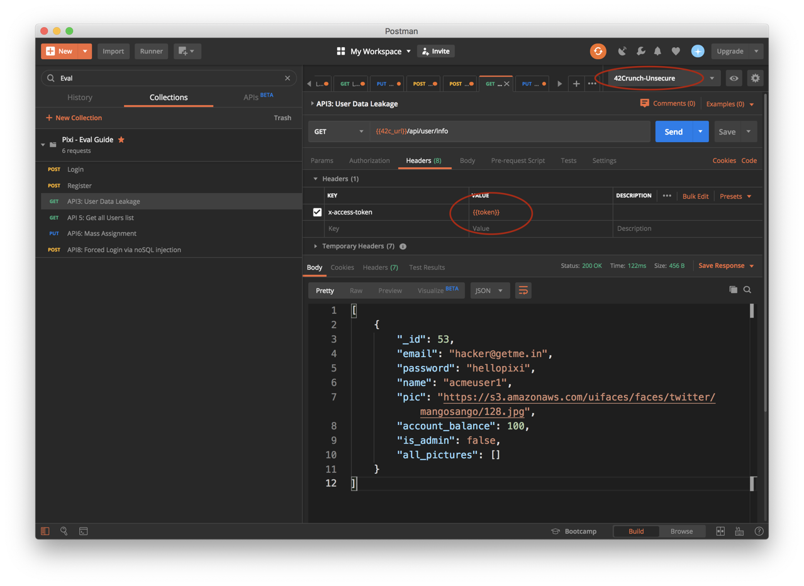
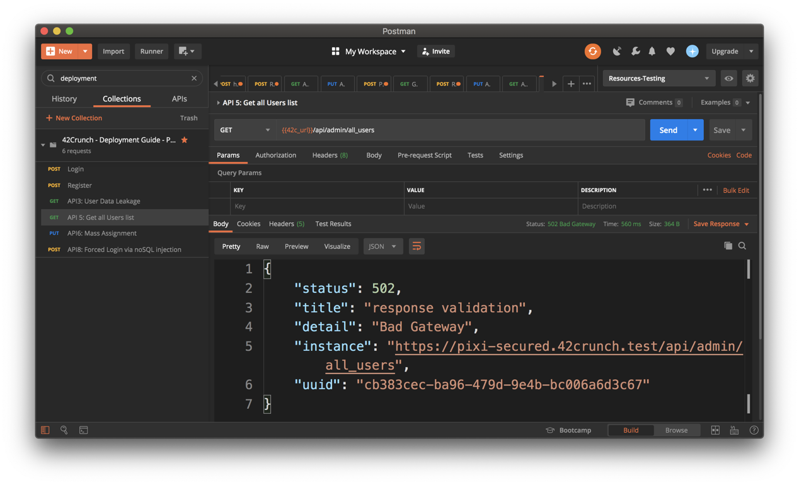

# 42Crunch API Firewall Tutorials

## Introduction

This document teaches you how to simulate attacks on an API and observe how [42Crunch](https://42crunch.com/) API Firewall blocks the attacks . For more information on [42Crunch Platform](https://platform.42crunch.com) and [42Crunch API Firewall](https://docs.42crunch.com/latest/content/concepts/api_protection.htm#Firewall), take a look at the [platform documentation](https://docs.42crunch.com/).

> The example setup in this document uses the Pixi API, a deliberately **vulnerable** API created as part of the [OWASP DevSlop](https://devslop.co/Home/Pixi) project to demonstrate common API issues. **We recommend that you install the Pixi API in a dedicated non-production environment, and delete the running resources once your tests are completed.** Do not leave the unprotected Pixi API running, it is vulnerable!

## Platform Overview

The 42Crunch platform provides tools to quickly protect APIs from typical threats, such as mass assignment, data leakage, exception leakage, or injections as described in the [OWASP Top10 for API Security](https://apisecurity.io/encyclopedia/content/owasp/owasp-api-security-top-10.htm). The platform was built to empower developers to become key actors of API security, enabling them to address security concerns as early as possible in the API lifecycle.

Typically, the platform would be used as follows:

* Developers describe precisely API contracts using the OpenAPI specification format (aka Swagger). This can be done via annotations in the API implementation code or using specialized tools such as SwaggerHub or Stoplight.
* The OpenAPI definition is imported into the 42Crunch platform and audited: the audit service analyses the definition and gives a security score from 0 to 100. The score is calculated based on how the API is secured (authentication, authorisation and transport of credentials) and how well the data is defined (parameters, headers, schemas, etc.). This only can be done manually via our SaaS console, via the developers favorite IDE or via CI/CD pipelines. The entire functionality is available via a REST API, so that bulk import and audit can be performed via scripting as well.
* Developers improve the score by following the remediation recommendations given in the audit reports until they reach a satisfactory score (usually above 75) and have fixed all critical/high severity issues.
* The resulting OpenAPI file now describes precisely the inputs and outputs of our API and as such can be used as a configuration [whitelist](https://42crunch.com/adopting-a-positive-security-model/) for the 42Crunch API threats protection engine (API Firewall).


## Prerequisites

In this guide, we use Postman to generate API requests for testing the 42Crunch API firewall. Therefore, you need a basic understanding of Postman and API testing [Postman getting started](https://learning.postman.com/docs/getting-started/introduction/) before running the tutorials.


## Understanding Pixi

Pixi requires a user to register or login in order to obtain a token, which is then used to invoke other operations. The Postman collection provided has been setup to extract the token from login or register responses, and add them automatically to the **current environment**, like this:

```javascript
var jsonData = pm.response.json();
pm.globals.set("token", jsonData.token);
```

Other operations, such as getUserInfo or updateUserInfo, take the value of the **token** variable set above and use it as the value of the **x-access-token** header, like this:



Make sure you always call either login or register before calling any other operations, or the request will fail at the firewall level, since the x-access-token header will be empty! When this happens, this is what you will see in the transaction logs of the API firewall .


# Blocking attacks with API Firewall

42Crunch API Firewall validates API requests and responses according to the OpenAPI definition of the protected API. In this section, you send various malicious requests to the API firewall to test its behavior.

## Viewing Transaction Logs

Whenever a request/response is blocked, transaction logs are automatically published to the 42Crunch platform. You can access the transaction logs viewer from the API protection tab. For each entry, you can view detailed information about the request and response step, as well as the latency for each step.


## Blocking Pixi API sample attacks

You can test the API firewall behavior with the following requests:

1. **Wrong verb**: the operation `Register` is defined to use `POST`. Try calling it with `GET` or other verbs, and see how requests are blocked.

   

2. **Wrong path**: any request to a path _not_ defined in the OAS definition is blocked. Try `/api/foo`, for example.

3. **Wrong `Content-Type`**: the OpenAPI definition for the target API states that the operation `/api/register` requires input in the form of `application/json`. If you use a different value or if you do not specify the `Content-Type`, the request is blocked. The most famous attack based on crafting Content-Type value is [*CVE-2017-5638*](https://www.synopsys.com/blogs/software-security/cve-2017-5638-apache-struts-vulnerability-explained/), an issue in Apache Struts which is at the root of Equifax's and many others breaches.

4. **Missing a parameter** that the input JSON structure requires: the schema for the operation `/api/register` specifies that the parameters `user`, `name`, `email`, and `password` are mandatory. If you leave out any of these parameters, the request is blocked.

5. **Wrong format for string values**: if you specify a value (such as email) in a format that does not match the schema, the request is blocked. For example, try to register a user with email `user@acme.com@presidence@elysee.fr` (you can read how this was exploited by hackers [here](https://apisecurity.io/issue-28-breaches-tchap-shopify-justdial/) ).

6. **Blocking out of boundaries data**: the 42Crunch API firewall also validates integer boundaries. If you try to invoke `api/register` using a negative balance (-100) for example), the request is blocked. This prevents Overflow type attacks.  Similarly, requests with strings which do not match the minLength/maxLength constraints are blocked.

7. **Blocking exception leakage**: the 42Crunch APIfirewall prevents data leakage or exception leakage. If you invoke `/api/register` using a negative balance between -50 and -1 , the response will be blocked. The backend API does not properly handle negative values and returns an exception. That exception is blocked by the firewall since the schema from the OAS file does not match the actual response.

8. **Blocking data leakage**: the Pixi API exposes an admin operation which lists all users within the database. This operation leaks admin status and passwords (it is a straight export from the backend database). If you invoke `API 5: Get Users List`, the response is blocked. You get an HTTP 502 error since the response from the back-end is invalid.

   

9. The Pixi API has a **MongoDB injection** vulnerability that allows logging into the application without specifying a password. You can try this by using the raw parameters `user=user@acme.com&pass[$ne]=` in Postman for a login request. You will see that you can log in to the unprotected API, but the request is blocked by API Firewall on the protected API.

10. **Mass assignment**:  the `API6: Mass Assignment` operation can be used to update a user record. It has a common issue (described in this [blog](https://42crunch.com/stopping_harbor_registry_attack/) ) by which a hacker with a valid token can change their role or administrative status. The OAS file does not declare is_admin as a valid input and as such this request will be blocked. Same occurs with the password. If you remove those two properties, the request will be accepted and both email and name are updated for the logged in user.

   

11. Reflected **XSS attack**: If you introduce a XSS attack like the example below in any property, the request is blocked:

    ```script
    <script>alert('hi')</script>
    ```

## Blocking admin operations

You have been able previously to invoke the `API5: Get Users List` admin operation, due to the fact it's declared in the Pixi OAS file. Although we blocked the response and prevented critical data from leaking, ideally we do not want this operation to be available. As such, we are going to replace the current OAS file, then update the configuration live.

1. Go to https://platform.42crunch.com and locate the Pixi API

2. At the top-right, select the Settings icon and choose **Update Definition**

   

3. Browse to the `resources/OASFiles` folder and select the `Pixi-v2.0-noadmin.json` file

4. Once the file has been imported, select the **Protection** tab

5. Click the **Reconfigure** button and type *confirm* to confirm the instance update

6. When the instance's list refreshes, it means the re-configuration was successful.

7. Back to Postman, try to invoke the `API5:Get Users list` operation. This time, the request is blocked with a 403 code, since this operation is not defined in the OpenAPI file anymore.


# Conclusion

In this tutorial, we have seen how the 42Crunch API firewall protects the API by enforcing the OpenAPI contract and blocking all inbound and outbound traffic that is not specifically described for the target API.